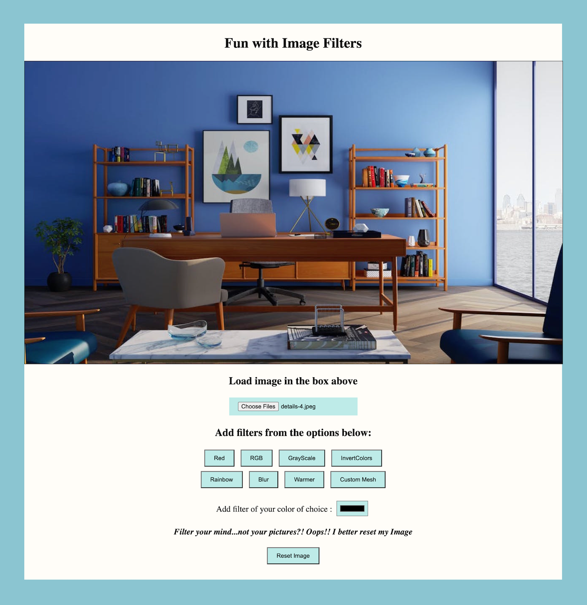

# Filters-Webpage

My first personal project.

### Tech Stack

JavaScript, CSS, HTML.

- Allows the user to upload an image
- Apply filters such as grayscale, blur, warm, rainbow, RGB-color, user's color choice, or add a meshed look to images.
- User can also reset the image to try different filters.

